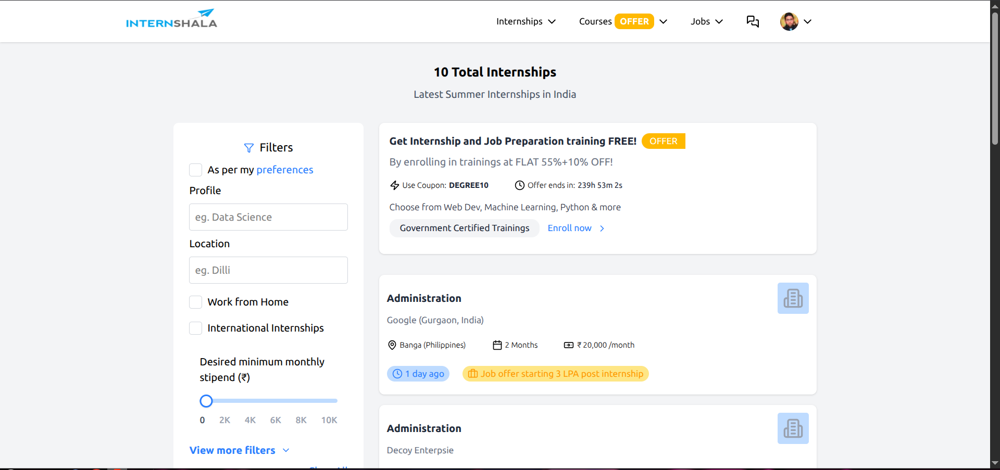

# 🚀 Internshala Home Page Clone 

Hey there!  
This is the submission for my Internshala internship assignment. After a couple of intense all-nighters and ungodly amount Diet Coke, it’s finally here — hope you enjoy checking it out as much as I enjoyed building it!

---

## 📸 Screenshot



---

## 📌 Features

- **Advanced Filtering**:  
  - Filter by job title, duration, location (city/international), and work mode (Remote/On-site)  
  - Combine multiple filters for refined results  
- **Responsive Design**:  
  - Fully mobile-friendly interface  
- **Interactive UI**:  
  - Hover cards, dropdown menus, and loading states  
- **Modular Design**:  
  - Clean, component-based structure  
- **API Integration**:  
  - `server.js` fetches data from the backend  
  - Uses `.env` with `VITE_API_URL` to connect to the deployed API  
  - Backend is deployed on Render

---

## 🚀 Live Demo

[View Live Deployment](https://internshala-home-page-clone.vercel.app/) 

---

## 🛠️ Tech Stack

- **Frontend**: React 18  
- **Styling**: Tailwind CSS  
- **Icons**: Lucide-react  
- **State Management**: React Hooks  
- **API Client**: Fetch API  
- **Build Tool**: Vite (or Create React App)

---

## 📁 Project Structure

```
src/
├── assets/              # Images/icons
├── components/
│   ├── common/          # Common components
│   ├── filter/          # Filter Box components
│   ├── hoverCard/       # Navbar hover components
│   ├── internship/      # Internship card components
│   └── layout/          # Contains Navbar
├── pages/               # Main views
├── App.js               # Main component
└── index.js             # Entry point
```

---

## ⚙️ How to Run

1. **Clone the repo**
   ```bash
   git clone https://github.com/yourusername/your-repo-name.git
   cd your-repo-name
   ```

2. **Set up environment**
   - Create a `.env` file in the root and add:
     ```
     VITE_API_URL="https://your-api-url.onrender.com"
     ```

3. **Install dependencies**
   ```bash
   npm install
   ```

4. **Start the project**
   ```bash
   npm run dev
   ```

---

## ❤️ Made with love by Rachit